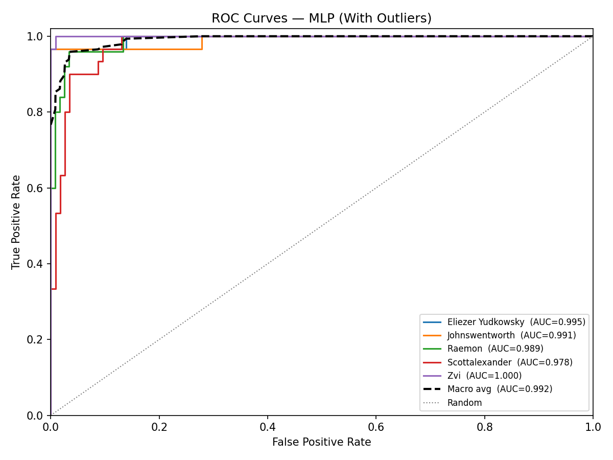

# MLP Authorship Classification — With Outliers

## Data Split

| Set | Passages | Proportion |
|-----|----------|------------|
| Train     | 433    | 60% |
| Dev       | 145      | 20%   |
| Test      | 145     | 20%  |
| **Total** | **723**| 100%      |

## Dev Set — Model Selection

All feature-subset × architecture combinations ranked by dev accuracy. Best configuration is retrained on train+dev and evaluated on the test set.

| Rank | Feature Subset | Architecture | Patience | Train Acc | Dev Acc |
|------|----------------|-------------|----------|-----------|----------|
| 1 | Top 50 features | Depth 10 | 15 | 0.9931 | 0.9103 ✓ |
| 2 | Top 50 features | Depth 10 | 10 | 0.9861 | 0.8897 |
| 3 | Top 74 features | Depth 1 (64,) | 15 | 0.9792 | 0.8897 |
| 4 | All 107 features | Depth 3 (64,64,64) | 10 | 0.9908 | 0.8897 |
| 5 | All 107 features | Depth 3 (64,64,64) | 15 | 0.9908 | 0.8897 |
| 6 | Top 50 features | Depth 2 (64, 32) | 10 | 0.9538 | 0.8828 |
| 7 | Top 50 features | Depth 2 (64, 32) | 15 | 0.9538 | 0.8828 |
| 8 | Top 74 features | Depth 2 (64, 32) | 5 | 0.9561 | 0.8828 |
| 9 | Top 74 features | Depth 2 (64, 32) | 10 | 0.9561 | 0.8828 |
| 10 | Top 74 features | Depth 2 (64, 32) | 15 | 0.9561 | 0.8828 |
| 11 | All 107 features | Depth 2 (64, 32) | 15 | 0.9954 | 0.8828 |
| 12 | All 107 features | Depth 1 (64,) | 10 | 0.9723 | 0.8690 |
| 13 | All 107 features | Depth 1 (64,) | 15 | 0.9723 | 0.8690 |
| 14 | Top 50 features | Depth 1 (64,) | 15 | 0.9677 | 0.8621 |
| 15 | Top 74 features | Depth 1 (64,) | 10 | 0.9584 | 0.8621 |
| 16 | All 107 features | Depth 2 (64, 32) | 10 | 0.9838 | 0.8621 |
| 17 | All 107 features | Depth 10 | 10 | 0.9908 | 0.8552 |
| 18 | All 107 features | Depth 10 | 15 | 0.9908 | 0.8552 |
| 19 | Top 30 features | Depth 1 (64,) | 10 | 0.8522 | 0.8414 |
| 20 | Top 30 features | Depth 1 (64,) | 15 | 0.8522 | 0.8414 |
| 21 | Top 30 features | Depth 2 (64, 32) | 10 | 0.9400 | 0.8414 |
| 22 | Top 30 features | Depth 2 (64, 32) | 15 | 0.9400 | 0.8414 |
| 23 | All 107 features | Depth 2 (64, 32) | 5 | 0.9515 | 0.8414 |
| 24 | Top 50 features | Depth 3 (64,64,64) | 5 | 0.9192 | 0.8345 |
| 25 | Top 50 features | Depth 3 (64,64,64) | 10 | 0.9192 | 0.8345 |
| 26 | Top 50 features | Depth 3 (64,64,64) | 15 | 0.9192 | 0.8345 |
| 27 | Top 74 features | Depth 3 (64,64,64) | 10 | 0.9284 | 0.8345 |
| 28 | Top 74 features | Depth 3 (64,64,64) | 15 | 0.9284 | 0.8345 |
| 29 | Top 50 features | Depth 1 (64,) | 5 | 0.8591 | 0.8207 |
| 30 | Top 50 features | Depth 1 (64,) | 10 | 0.8591 | 0.8207 |
| 31 | All 107 features | Depth 1 (64,) | 5 | 0.9238 | 0.8207 |
| 32 | Top 30 features | Depth 1 (64,) | 5 | 0.8314 | 0.8138 |
| 33 | Top 50 features | Depth 2 (64, 32) | 5 | 0.8430 | 0.8138 |
| 34 | Top 50 features | Depth 10 | 5 | 0.8868 | 0.8138 |
| 35 | Top 74 features | Depth 10 | 5 | 0.9515 | 0.8138 |
| 36 | Top 74 features | Depth 10 | 10 | 0.9515 | 0.8138 |
| 37 | Top 74 features | Depth 10 | 15 | 0.9515 | 0.8138 |
| 38 | Top 30 features | Depth 3 (64,64,64) | 5 | 0.8776 | 0.8069 |
| 39 | Top 30 features | Depth 3 (64,64,64) | 10 | 0.8776 | 0.8069 |
| 40 | Top 30 features | Depth 3 (64,64,64) | 15 | 0.8776 | 0.8069 |
| 41 | Top 15 features | Depth 2 (64, 32) | 10 | 0.8661 | 0.7862 |
| 42 | Top 15 features | Depth 2 (64, 32) | 15 | 0.8661 | 0.7862 |
| 43 | Top 15 features | Depth 10 | 10 | 0.8822 | 0.7862 |
| 44 | Top 15 features | Depth 10 | 15 | 0.8822 | 0.7862 |
| 45 | Top 30 features | Depth 10 | 5 | 0.8938 | 0.7724 |
| 46 | Top 30 features | Depth 10 | 10 | 0.8938 | 0.7724 |
| 47 | Top 30 features | Depth 10 | 15 | 0.8938 | 0.7724 |
| 48 | Top 74 features | Depth 1 (64,) | 5 | 0.8383 | 0.7724 |
| 49 | Top 15 features | Depth 3 (64,64,64) | 10 | 0.8614 | 0.7655 |
| 50 | Top 15 features | Depth 3 (64,64,64) | 15 | 0.8614 | 0.7655 |
| 51 | Top 74 features | Depth 3 (64,64,64) | 5 | 0.8730 | 0.7655 |
| 52 | Top 30 features | Depth 2 (64, 32) | 5 | 0.8453 | 0.7517 |
| 53 | All 107 features | Depth 10 | 5 | 0.9007 | 0.7448 |
| 54 | Top 15 features | Depth 1 (64,) | 5 | 0.8337 | 0.7379 |
| 55 | Top 15 features | Depth 1 (64,) | 10 | 0.8337 | 0.7379 |
| 56 | Top 15 features | Depth 1 (64,) | 15 | 0.8337 | 0.7379 |
| 57 | All 107 features | Depth 3 (64,64,64) | 5 | 0.8430 | 0.7310 |
| 58 | Top 15 features | Depth 3 (64,64,64) | 5 | 0.7898 | 0.7103 |
| 59 | Top 15 features | Depth 2 (64, 32) | 5 | 0.7344 | 0.7034 |
| 60 | Top 15 features | Depth 10 | 5 | 0.6074 | 0.5724 |
| 61 | Top 15 features | Depth 50 | 5 | 0.2009 | 0.2069 |
| 62 | Top 15 features | Depth 50 | 10 | 0.2009 | 0.2069 |
| 63 | Top 15 features | Depth 50 | 15 | 0.2009 | 0.2069 |
| 64 | Top 30 features | Depth 50 | 5 | 0.2079 | 0.2069 |
| 65 | Top 30 features | Depth 50 | 10 | 0.2079 | 0.2069 |
| 66 | Top 30 features | Depth 50 | 15 | 0.2079 | 0.2069 |
| 67 | Top 50 features | Depth 50 | 5 | 0.2079 | 0.2069 |
| 68 | Top 50 features | Depth 50 | 10 | 0.2079 | 0.2069 |
| 69 | Top 50 features | Depth 50 | 15 | 0.2079 | 0.2069 |
| 70 | Top 74 features | Depth 50 | 5 | 0.2079 | 0.2069 |
| 71 | Top 74 features | Depth 50 | 10 | 0.2079 | 0.2069 |
| 72 | Top 74 features | Depth 50 | 15 | 0.2079 | 0.2069 |
| 73 | All 107 features | Depth 50 | 5 | 0.2079 | 0.2069 |
| 74 | All 107 features | Depth 50 | 10 | 0.2079 | 0.2069 |
| 75 | All 107 features | Depth 50 | 15 | 0.2079 | 0.2069 |

**Best model:** Top 50 features · Depth 10 · patience=15 — Dev accuracy: **0.9103**

## Final Test Set Results

Retrained on train+dev (578 passages) using **Top 50 features**, **Depth 10**.

### Key Metrics

| Metric | Value |
|--------|-------|
| Accuracy       | 0.9310 |
| Weighted F1    | 0.9316 |
| ROC-AUC (macro OvR) | 0.9906 |
| ECE            | 0.0544 |

### Per-Class Report

|                   |   precision |   recall |   f1-score |   support |
|:------------------|------------:|---------:|-----------:|----------:|
| Eliezer Yudkowsky |    1        | 0.933333 |   0.965517 |        30 |
| Johnswentworth    |    0.966667 | 0.966667 |   0.966667 |        30 |
| Raemon            |    0.851852 | 0.92     |   0.884615 |        25 |
| Scottalexander    |    0.866667 | 0.866667 |   0.866667 |        30 |
| Zvi               |    0.966667 | 0.966667 |   0.966667 |        30 |
| macro avg         |    0.93037  | 0.930667 |   0.930027 |       145 |
| weighted avg      |    0.933078 | 0.931034 |   0.931592 |       145 |

### Confusion Matrix

_Rows = actual, Columns = predicted._

| Actual \ Pred | **Eliezer Yudkow** | **Johnswentworth** | **Raemon** | **Scottalexander** | **Zvi** |
|---|---|---|---|---|---|
| **Eliezer Yudkow** | 28 | 0 | 0 | 2 | 0 |
| **Johnswentworth** | 0 | 29 | 0 | 1 | 0 |
| **Raemon** | 0 | 1 | 23 | 1 | 0 |
| **Scottalexander** | 0 | 0 | 3 | 26 | 1 |
| **Zvi** | 0 | 0 | 1 | 0 | 29 |

## ROC Curves

