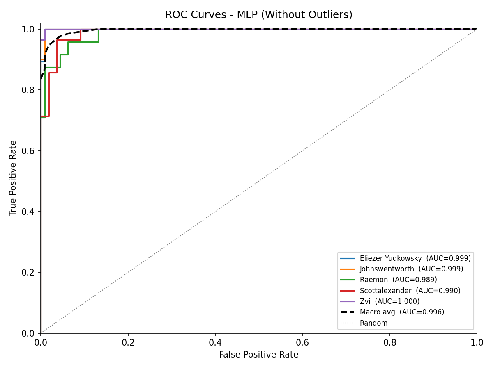

# MLP Authorship Classification - Without Outliers

## Data Split

| Set | Passages | Proportion |
|-----|----------|------------|
| Train     | 411    | 60% |
| Dev       | 137      | 20%   |
| Test      | 138     | 20%  |
| **Total** | **686**| 100%      |

## Dev Set - Model Selection

Dev accuracy for every feature-subset x architecture combination (patience=15, batch_size=32). Best cell marked with checkmark.

| Feature Subset | Depth 1 (64,) | Depth 3 (64,64,64) | Depth 10 | Depth 50 |
|---|---|---|---|---|
| All 107 features | 0.9270 ✓ | 0.8905 | 0.8613 | 0.2117 |
| Top 30 features | 0.8540 | 0.8467 | 0.8613 | 0.2117 |
| Top 50 features | 0.8321 | 0.8394 | 0.8321 | 0.2117 |

**Best model:** All 107 features x Depth 1 (64,) - Dev accuracy: **0.9270**

## Final Test Set Results

Retrained on train+dev (548 passages) using **All 107 features**, **Depth 1 (64,)**.

### Key Metrics

| Metric | Value |
|--------|-------|
| Accuracy            | 0.9420 |
| Weighted F1         | 0.9413 |
| ROC-AUC (macro OvR) | 0.9953 |

### Per-Class Report

|                   |   precision |   recall |   f1-score |   support |
|:------------------|------------:|---------:|-----------:|----------:|
| Eliezer Yudkowsky |    0.965517 | 1        |   0.982456 |        28 |
| Johnswentworth    |    0.967742 | 1        |   0.983607 |        30 |
| Raemon            |    0.875    | 0.875    |   0.875    |        24 |
| Scottalexander    |    0.923077 | 0.857143 |   0.888889 |        28 |
| Zvi               |    0.964286 | 0.964286 |   0.964286 |        28 |
| macro avg         |    0.939124 | 0.939286 |   0.938847 |       138 |
| weighted avg      |    0.941398 | 0.942029 |   0.941347 |       138 |

### Confusion Matrix

_Rows = actual, Columns = predicted._

| Actual \ Pred | **Eliezer Yudkow** | **Johnswentworth** | **Raemon** | **Scottalexander** | **Zvi** |
|---|---|---|---|---|---|
| **Eliezer Yudkow** | 28 | 0 | 0 | 0 | 0 |
| **Johnswentworth** | 0 | 30 | 0 | 0 | 0 |
| **Raemon** | 1 | 0 | 21 | 2 | 0 |
| **Scottalexander** | 0 | 1 | 2 | 24 | 1 |
| **Zvi** | 0 | 0 | 1 | 0 | 27 |

## ROC Curves

