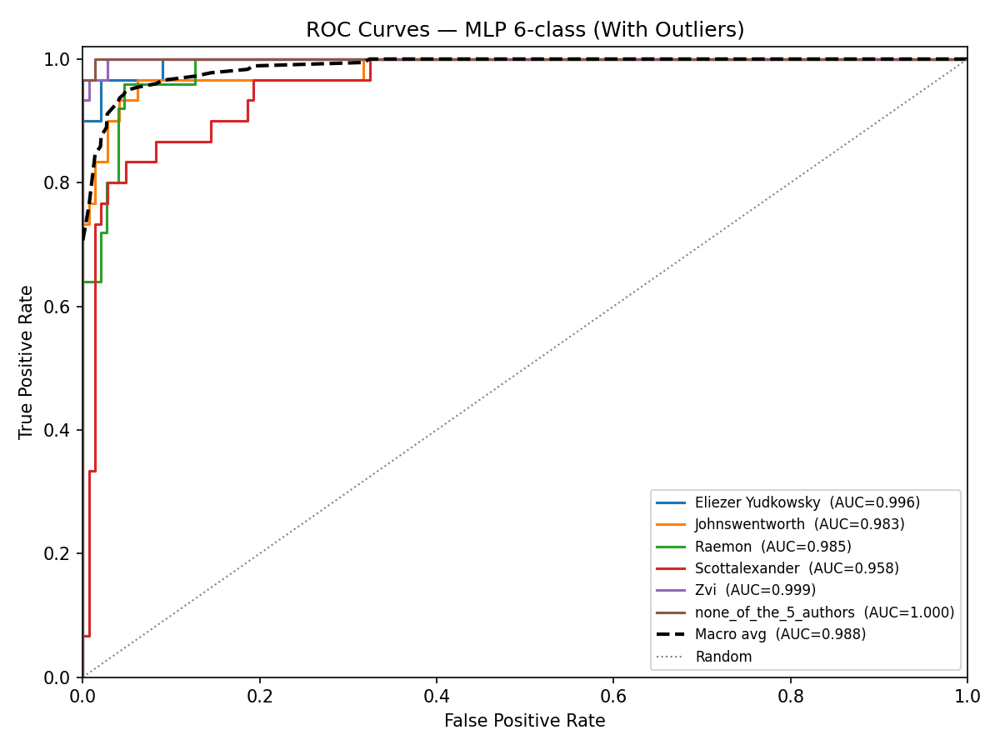

# MLP 6-Class Authorship Classification — With Outliers

## None-of-the-5-Authors Class Construction

**15 authors × 10 articles = 150 total passages** labelled `none_of_the_5_authors`.

Authors used for the none class:

- `ricraz`
- `benquo`
- `abramdemski`
- `sarahconstantin`
- `holdenkarnofsky`
- `gordon-seidoh-worley`
- `screwtape`
- `buck`
- `turntrout`
- `nunosempere`
- `benito`
- `petermccluskey`
- `joe-carlsmith`
- `adamshimi`
- `tsvibt`

## Data Split

| Set | Passages | Proportion |
|-----|----------|------------|
| Train     | 523    | 60% |
| Dev       | 175      | 20%   |
| Test      | 175     | 20%  |
| **Total** | **873**| 100%      |

## Dev Set — Model Selection

All feature-subset × architecture combinations ranked by dev accuracy. Best configuration is retrained on train+dev and evaluated on the test set.

| Rank | Feature Subset | Architecture | Patience | Train Acc | Dev Acc |
|------|----------------|-------------|----------|-----------|----------|
| 1 | All 107 features | Depth 1 (64,) | 10 | 0.9790 | 0.9371 ✓ |
| 2 | All 107 features | Depth 1 (64,) | 15 | 0.9790 | 0.9371 |
| 3 | Top 74 features | Depth 1 (64,) | 15 | 0.9656 | 0.9314 |
| 4 | All 107 features | Depth 3 (64,64,64) | 10 | 0.9847 | 0.9257 |
| 5 | All 107 features | Depth 3 (64,64,64) | 15 | 0.9847 | 0.9257 |
| 6 | Top 30 features | Depth 3 (64,64,64) | 10 | 0.9598 | 0.9143 |
| 7 | Top 30 features | Depth 3 (64,64,64) | 15 | 0.9598 | 0.9143 |
| 8 | Top 30 features | Depth 1 (64,) | 15 | 0.9312 | 0.9086 |
| 9 | Top 74 features | Depth 2 (64, 32) | 10 | 0.9598 | 0.9029 |
| 10 | Top 74 features | Depth 2 (64, 32) | 15 | 0.9598 | 0.9029 |
| 11 | All 107 features | Depth 1 (64,) | 5 | 0.9293 | 0.9029 |
| 12 | Top 50 features | Depth 10 | 5 | 0.9694 | 0.8971 |
| 13 | Top 50 features | Depth 10 | 10 | 0.9694 | 0.8971 |
| 14 | Top 50 features | Depth 10 | 15 | 0.9694 | 0.8971 |
| 15 | Top 74 features | Depth 1 (64,) | 5 | 0.9235 | 0.8971 |
| 16 | Top 74 features | Depth 1 (64,) | 10 | 0.9235 | 0.8971 |
| 17 | All 107 features | Depth 3 (64,64,64) | 5 | 0.9465 | 0.8971 |
| 18 | All 107 features | Depth 2 (64, 32) | 5 | 0.9178 | 0.8857 |
| 19 | All 107 features | Depth 2 (64, 32) | 10 | 0.9178 | 0.8857 |
| 20 | All 107 features | Depth 2 (64, 32) | 15 | 0.9178 | 0.8857 |
| 21 | All 107 features | Depth 10 | 5 | 0.9732 | 0.8800 |
| 22 | All 107 features | Depth 10 | 10 | 0.9732 | 0.8800 |
| 23 | All 107 features | Depth 10 | 15 | 0.9732 | 0.8800 |
| 24 | Top 30 features | Depth 10 | 10 | 0.9618 | 0.8743 |
| 25 | Top 30 features | Depth 10 | 15 | 0.9618 | 0.8743 |
| 26 | Top 15 features | Depth 10 | 5 | 0.9063 | 0.8686 |
| 27 | Top 15 features | Depth 10 | 10 | 0.9063 | 0.8686 |
| 28 | Top 15 features | Depth 10 | 15 | 0.9063 | 0.8686 |
| 29 | Top 50 features | Depth 2 (64, 32) | 5 | 0.8910 | 0.8686 |
| 30 | Top 50 features | Depth 2 (64, 32) | 10 | 0.8910 | 0.8686 |
| 31 | Top 50 features | Depth 2 (64, 32) | 15 | 0.8910 | 0.8686 |
| 32 | Top 50 features | Depth 1 (64,) | 10 | 0.9178 | 0.8629 |
| 33 | Top 50 features | Depth 1 (64,) | 15 | 0.9178 | 0.8629 |
| 34 | Top 30 features | Depth 1 (64,) | 10 | 0.9006 | 0.8571 |
| 35 | Top 30 features | Depth 2 (64, 32) | 10 | 0.8910 | 0.8571 |
| 36 | Top 30 features | Depth 2 (64, 32) | 15 | 0.8910 | 0.8571 |
| 37 | Top 50 features | Depth 3 (64,64,64) | 5 | 0.9140 | 0.8571 |
| 38 | Top 50 features | Depth 3 (64,64,64) | 10 | 0.9140 | 0.8571 |
| 39 | Top 50 features | Depth 3 (64,64,64) | 15 | 0.9140 | 0.8571 |
| 40 | Top 74 features | Depth 3 (64,64,64) | 5 | 0.9235 | 0.8457 |
| 41 | Top 74 features | Depth 3 (64,64,64) | 10 | 0.9235 | 0.8457 |
| 42 | Top 74 features | Depth 3 (64,64,64) | 15 | 0.9235 | 0.8457 |
| 43 | Top 30 features | Depth 10 | 5 | 0.9006 | 0.8400 |
| 44 | Top 30 features | Depth 3 (64,64,64) | 5 | 0.8662 | 0.8343 |
| 45 | Top 74 features | Depth 2 (64, 32) | 5 | 0.9063 | 0.8343 |
| 46 | Top 15 features | Depth 3 (64,64,64) | 5 | 0.8451 | 0.8286 |
| 47 | Top 15 features | Depth 3 (64,64,64) | 10 | 0.8451 | 0.8286 |
| 48 | Top 15 features | Depth 3 (64,64,64) | 15 | 0.8451 | 0.8286 |
| 49 | Top 15 features | Depth 1 (64,) | 15 | 0.8451 | 0.8229 |
| 50 | Top 50 features | Depth 1 (64,) | 5 | 0.9006 | 0.8229 |
| 51 | Top 30 features | Depth 1 (64,) | 5 | 0.8566 | 0.8114 |
| 52 | Top 30 features | Depth 2 (64, 32) | 5 | 0.8528 | 0.8057 |
| 53 | Top 74 features | Depth 10 | 5 | 0.8662 | 0.7943 |
| 54 | Top 74 features | Depth 10 | 10 | 0.8662 | 0.7943 |
| 55 | Top 74 features | Depth 10 | 15 | 0.8662 | 0.7943 |
| 56 | Top 15 features | Depth 2 (64, 32) | 5 | 0.8184 | 0.7486 |
| 57 | Top 15 features | Depth 2 (64, 32) | 10 | 0.8184 | 0.7486 |
| 58 | Top 15 features | Depth 2 (64, 32) | 15 | 0.8184 | 0.7486 |
| 59 | Top 15 features | Depth 1 (64,) | 5 | 0.7648 | 0.7429 |
| 60 | Top 15 features | Depth 1 (64,) | 10 | 0.7648 | 0.7429 |
| 61 | Top 15 features | Depth 50 | 5 | 0.1721 | 0.1714 |
| 62 | Top 15 features | Depth 50 | 10 | 0.1721 | 0.1714 |
| 63 | Top 15 features | Depth 50 | 15 | 0.1721 | 0.1714 |
| 64 | Top 30 features | Depth 50 | 5 | 0.1721 | 0.1714 |
| 65 | Top 30 features | Depth 50 | 10 | 0.1721 | 0.1714 |
| 66 | Top 30 features | Depth 50 | 15 | 0.1721 | 0.1714 |
| 67 | Top 50 features | Depth 50 | 5 | 0.1721 | 0.1714 |
| 68 | Top 50 features | Depth 50 | 10 | 0.1721 | 0.1714 |
| 69 | Top 50 features | Depth 50 | 15 | 0.1721 | 0.1714 |
| 70 | Top 74 features | Depth 50 | 5 | 0.1721 | 0.1714 |
| 71 | Top 74 features | Depth 50 | 10 | 0.1721 | 0.1714 |
| 72 | Top 74 features | Depth 50 | 15 | 0.1721 | 0.1714 |
| 73 | All 107 features | Depth 50 | 5 | 0.1721 | 0.1714 |
| 74 | All 107 features | Depth 50 | 10 | 0.1721 | 0.1714 |
| 75 | All 107 features | Depth 50 | 15 | 0.1721 | 0.1714 |

**Best model:** All 107 features · Depth 1 (64,) · patience=10 — Dev accuracy: **0.9371**

## Final Test Set Results

Retrained on train+dev (698 passages) using **All 107 features**, **Depth 1 (64,)**.

### Key Metrics

| Metric | Value |
|--------|-------|
| Accuracy            | 0.8800 |
| Weighted F1         | 0.8798 |
| ROC-AUC (macro OvR) | 0.9867 |
| ECE                 | 0.1021 |

### Per-Class Report

|                       |   precision |   recall |   f1-score |   support |
|:----------------------|------------:|---------:|-----------:|----------:|
| Eliezer Yudkowsky     |    0.848485 | 0.933333 |   0.888889 |        30 |
| Johnswentworth        |    0.777778 | 0.933333 |   0.848485 |        30 |
| Raemon                |    0.769231 | 0.8      |   0.784314 |        25 |
| Scottalexander        |    0.913043 | 0.7      |   0.792453 |        30 |
| Zvi                   |    1        | 0.933333 |   0.965517 |        30 |
| none_of_the_5_authors |    1        | 0.966667 |   0.983051 |        30 |
| macro avg             |    0.884756 | 0.877778 |   0.877118 |       175 |
| weighted avg          |    0.888057 | 0.88     |   0.87977  |       175 |

### Confusion Matrix

_Rows = actual, Columns = predicted._

| Actual \ Pred | **Eliezer Yudkow** | **Johnswentworth** | **Raemon** | **Scottalexander** | **Zvi** | **none_of_the_5_** |
|---|---|---|---|---|---|---|
| **Eliezer Yudkow** | 28 | 0 | 2 | 0 | 0 | 0 |
| **Johnswentworth** | 1 | 28 | 0 | 1 | 0 | 0 |
| **Raemon** | 1 | 3 | 20 | 1 | 0 | 0 |
| **Scottalexander** | 2 | 5 | 2 | 21 | 0 | 0 |
| **Zvi** | 0 | 0 | 2 | 0 | 28 | 0 |
| **none_of_the_5_** | 1 | 0 | 0 | 0 | 0 | 29 |

## ROC Curves

