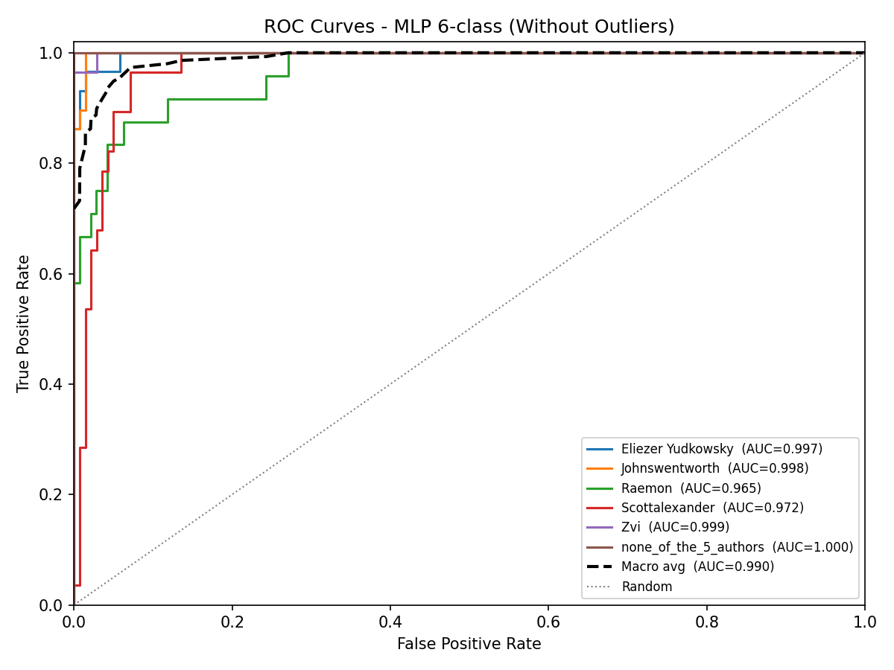

# MLP 6-Class Authorship Classification - Without Outliers

## None-of-the-5-Authors Class Construction

**15 authors x 10 articles = 150 total passages** labelled `none_of_the_5_authors`.

Authors used for the none class:

- `ricraz`
- `benquo`
- `abramdemski`
- `sarahconstantin`
- `holdenkarnofsky`
- `gordon-seidoh-worley`
- `screwtape`
- `buck`
- `turntrout`
- `nunosempere`
- `benito`
- `petermccluskey`
- `joe-carlsmith`
- `adamshimi`
- `tsvibt`

## Data Split

| Set | Passages | Proportion |
|-----|----------|------------|
| Train     | 501    | 60% |
| Dev       | 168      | 20%   |
| Test      | 168     | 20%  |
| **Total** | **837**| 100%      |

## Dev Set - Model Selection

Dev accuracy for every feature-subset x architecture combination (patience=15, batch_size=32). Best cell marked with checkmark.

| Feature Subset | Depth 1 (64,) | Depth 3 (64,64,64) | Depth 10 | Depth 50 |
|---|---|---|---|---|
| All 107 features | 0.9345 ✓ | 0.8750 | 0.8810 | 0.1726 |
| Top 50 features | 0.8810 | 0.9286 | 0.9167 | 0.1667 |
| Top 30 features | 0.9226 | 0.8988 | 0.8869 | 0.1786 |

**Best model:** All 107 features x Depth 1 (64,) - Dev accuracy: **0.9345**

## Final Test Set Results

Retrained on train+dev (669 passages) using **All 107 features**, **Depth 1 (64,)**.

### Key Metrics

| Metric | Value |
|--------|-------|
| Accuracy            | 0.9167 |
| Weighted F1         | 0.9172 |
| ROC-AUC (macro OvR) | 0.9886 |

### Per-Class Report

|                       |   precision |   recall |   f1-score |   support |
|:----------------------|------------:|---------:|-----------:|----------:|
| Eliezer Yudkowsky     |    1        | 0.862069 |   0.925926 |        29 |
| Johnswentworth        |    0.90625  | 1        |   0.95082  |        29 |
| Raemon                |    0.791667 | 0.791667 |   0.791667 |        24 |
| Scottalexander        |    0.8      | 0.857143 |   0.827586 |        28 |
| Zvi                   |    1        | 0.964286 |   0.981818 |        28 |
| none_of_the_5_authors |    1        | 1        |   1        |        30 |
| macro avg             |    0.916319 | 0.912527 |   0.912969 |       168 |
| weighted avg          |    0.920722 | 0.916667 |   0.917196 |       168 |

### Confusion Matrix

_Rows = actual, Columns = predicted._

| Actual \ Pred | **Eliezer Yudkow** | **Johnswentworth** | **Raemon** | **Scottalexander** | **Zvi** | **none_of_the_5_** |
|---|---|---|---|---|---|---|
| **Eliezer Yudkow** | 25 | 0 | 3 | 1 | 0 | 0 |
| **Johnswentworth** | 0 | 29 | 0 | 0 | 0 | 0 |
| **Raemon** | 0 | 1 | 19 | 4 | 0 | 0 |
| **Scottalexander** | 0 | 2 | 2 | 24 | 0 | 0 |
| **Zvi** | 0 | 0 | 0 | 1 | 27 | 0 |
| **none_of_the_5_** | 0 | 0 | 0 | 0 | 0 | 30 |

## ROC Curves

