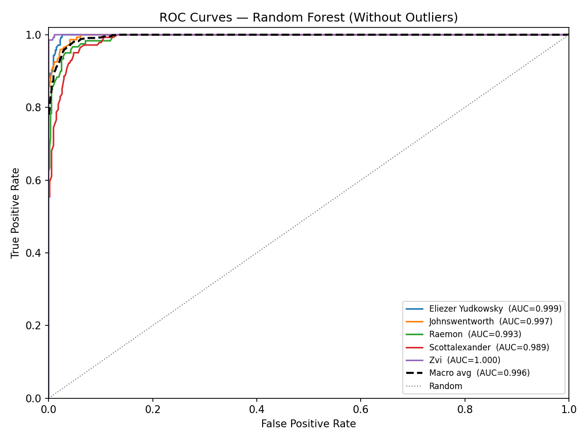

# Random Forest Authorship Classification — Without Outliers

## Configuration

- **Classifier:** Random Forest
- **Outer folds:** 5 (performance estimation)
- **Inner folds:** 3 (hyperparameter tuning via GridSearchCV)
- **Param combinations:** 36
- **Passages:** 686
- **Features:** all 107

**Search grid:**

| Hyperparameter | Values |
|----------------|--------|
| `n_estimators` | [100, 200, 300] |
| `max_depth` | [None, 10, 20] |
| `min_samples_split` | [2, 5] |
| `max_features` | ['sqrt', 'log2'] |

## Per-Fold Results

| Fold | Accuracy | Precision (macro) | Recall (macro) | Weighted F1 | ROC-AUC | Best Params |
|------|----------|-------------------|----------------|-------------|---------|-------------|
| 1 | 0.8986 | 0.9153 | 0.8958 | 0.8998 | 0.9923 | `max_depth=None, max_features=log2, min_samples_split=2, n_estimators=200` |
| 2 | 0.9489 | 0.9533 | 0.9455 | 0.9486 | 0.9977 | `max_depth=None, max_features=log2, min_samples_split=2, n_estimators=300` |
| 3 | 0.9343 | 0.9354 | 0.9367 | 0.9341 | 0.9959 | `max_depth=None, max_features=log2, min_samples_split=2, n_estimators=100` |
| 4 | 0.9124 | 0.9171 | 0.9129 | 0.9138 | 0.9951 | `max_depth=None, max_features=log2, min_samples_split=2, n_estimators=200` |
| 5 | 0.9781 | 0.9778 | 0.9786 | 0.9781 | 0.9997 | `max_depth=None, max_features=sqrt, min_samples_split=2, n_estimators=100` |

## Summary

| Metric | Mean | Std |
|--------|------|-----|
| Accuracy            | 0.9345  | 0.0312  |
| Precision (macro)   | 0.9398 | 0.0263 |
| Recall (macro)      | 0.9339    | 0.0318    |
| Weighted F1         | 0.9349      | 0.0306      |
| ROC-AUC (macro OvR) | 0.9961   | 0.0028   |
| ECE (aggregated)    | 0.2283               | —                           |

## Average Classification Report

_Per-class metrics averaged across all outer folds._

|                   |   precision |   recall |   f1-score |   support |
|:------------------|------------:|---------:|-----------:|----------:|
| Eliezer Yudkowsky |    0.955346 | 0.915517 |   0.933799 |      28.2 |
| Johnswentworth    |    0.973749 | 0.945287 |   0.958059 |      29.4 |
| Raemon            |    0.924786 | 0.908333 |   0.911033 |      24   |
| Scottalexander    |    0.851872 | 0.907635 |   0.875979 |      28.2 |
| Zvi               |    0.993103 | 0.992593 |   0.992718 |      27.4 |
| macro avg         |    0.939771 | 0.933873 |   0.934318 |     137.2 |
| weighted avg      |    0.94011  | 0.934455 |   0.934861 |     137.2 |

## Confusion Matrix

_Aggregated across all outer folds. Rows = actual, Columns = predicted._

| Actual \ Pred | **Eliezer Yudkow** | **Johnswentworth** | **Raemon** | **Scottalexander** | **Zvi** |
|---|---|---|---|---|---|
| **Eliezer Yudkow** | 129 | 1 | 1 | 10 | 0 |
| **Johnswentworth** | 0 | 139 | 2 | 6 | 0 |
| **Raemon** | 2 | 2 | 109 | 7 | 0 |
| **Scottalexander** | 4 | 1 | 7 | 128 | 1 |
| **Zvi** | 0 | 0 | 0 | 1 | 136 |

## ROC Curves

