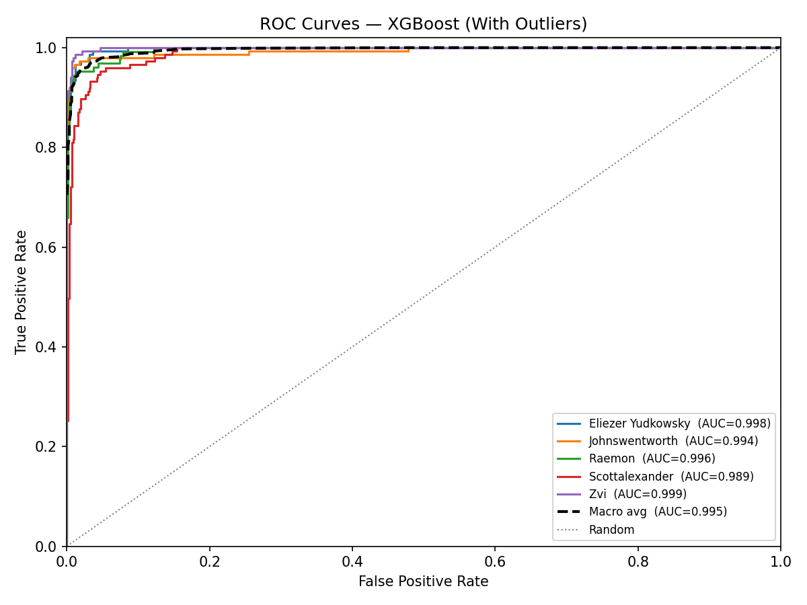

# XGBoost Authorship Classification — With Outliers

## Configuration

- **Classifier:** XGBoost
- **Outer folds:** 5 (performance estimation)
- **Inner folds:** 3 (hyperparameter tuning via GridSearchCV)
- **Param combinations:** 27
- **Passages:** 723
- **Features:** all 107

**Search grid:**

| Hyperparameter | Values |
|----------------|--------|
| `n_estimators` | [100, 200, 300] |
| `max_depth` | [3, 5, 7] |
| `learning_rate` | [0.05, 0.1, 0.2] |

## Per-Fold Results

| Fold | Accuracy | Precision (macro) | Recall (macro) | Weighted F1 | ROC-AUC | Best Params |
|------|----------|-------------------|----------------|-------------|---------|-------------|
| 1 | 0.9034 | 0.9066 | 0.9006 | 0.9033 | 0.9890 | `learning_rate=0.1, max_depth=3, n_estimators=100` |
| 2 | 0.9448 | 0.9437 | 0.9467 | 0.9440 | 0.9920 | `learning_rate=0.2, max_depth=3, n_estimators=300` |
| 3 | 0.9448 | 0.9525 | 0.9427 | 0.9442 | 0.9968 | `learning_rate=0.2, max_depth=3, n_estimators=200` |
| 4 | 0.9583 | 0.9601 | 0.9584 | 0.9580 | 0.9986 | `learning_rate=0.2, max_depth=3, n_estimators=200` |
| 5 | 0.9722 | 0.9739 | 0.9715 | 0.9722 | 0.9990 | `learning_rate=0.2, max_depth=3, n_estimators=300` |

## Summary

| Metric | Mean | Std |
|--------|------|-----|
| Accuracy            | 0.9447  | 0.0257  |
| Precision (macro)   | 0.9474 | 0.0253 |
| Recall (macro)      | 0.9440    | 0.0267    |
| Weighted F1         | 0.9444      | 0.0257      |
| ROC-AUC (macro OvR) | 0.9951   | 0.0044   |
| ECE (aggregated)    | 0.0176               | —                           |

## Average Classification Report

_Per-class metrics averaged across all outer folds._

|                   |   precision |   recall |   f1-score |   support |
|:------------------|------------:|---------:|-----------:|----------:|
| Eliezer Yudkowsky |    0.948575 | 0.966667 |   0.957262 |      30   |
| Johnswentworth    |    0.9802   | 0.926667 |   0.950806 |      30   |
| Raemon            |    0.968094 | 0.921538 |   0.94246  |      25.2 |
| Scottalexander    |    0.884793 | 0.918391 |   0.899836 |      29.4 |
| Zvi               |    0.955215 | 0.986667 |   0.970485 |      30   |
| macro avg         |    0.947375 | 0.943986 |   0.94417  |     144.6 |
| weighted avg      |    0.946956 | 0.944732 |   0.944355 |     144.6 |

## Confusion Matrix

_Aggregated across all outer folds. Rows = actual, Columns = predicted._

| Actual \ Pred | **Eliezer Yudkow** | **Johnswentworth** | **Raemon** | **Scottalexander** | **Zvi** |
|---|---|---|---|---|---|
| **Eliezer Yudkow** | 145 | 0 | 0 | 5 | 0 |
| **Johnswentworth** | 0 | 139 | 1 | 9 | 1 |
| **Raemon** | 5 | 1 | 116 | 2 | 2 |
| **Scottalexander** | 3 | 2 | 3 | 135 | 4 |
| **Zvi** | 0 | 0 | 0 | 2 | 148 |

## ROC Curves

