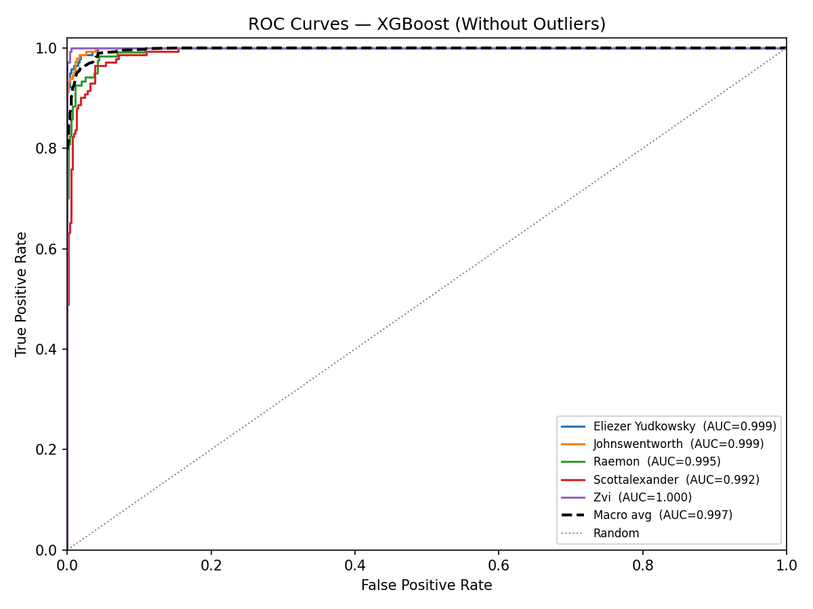

# XGBoost Authorship Classification — Without Outliers

## Configuration

- **Classifier:** XGBoost
- **Outer folds:** 5 (performance estimation)
- **Inner folds:** 3 (hyperparameter tuning via GridSearchCV)
- **Param combinations:** 27
- **Passages:** 686
- **Features:** all 107

**Search grid:**

| Hyperparameter | Values |
|----------------|--------|
| `n_estimators` | [100, 200, 300] |
| `max_depth` | [3, 5, 7] |
| `learning_rate` | [0.05, 0.1, 0.2] |

## Per-Fold Results

| Fold | Accuracy | Precision (macro) | Recall (macro) | Weighted F1 | ROC-AUC | Best Params |
|------|----------|-------------------|----------------|-------------|---------|-------------|
| 1 | 0.9420 | 0.9537 | 0.9391 | 0.9429 | 0.9974 | `learning_rate=0.2, max_depth=5, n_estimators=300` |
| 2 | 0.9270 | 0.9340 | 0.9245 | 0.9269 | 0.9980 | `learning_rate=0.1, max_depth=3, n_estimators=300` |
| 3 | 0.9416 | 0.9410 | 0.9395 | 0.9407 | 0.9966 | `learning_rate=0.1, max_depth=5, n_estimators=200` |
| 4 | 0.9489 | 0.9508 | 0.9514 | 0.9492 | 0.9957 | `learning_rate=0.1, max_depth=5, n_estimators=300` |
| 5 | 0.9708 | 0.9707 | 0.9707 | 0.9709 | 0.9978 | `learning_rate=0.1, max_depth=5, n_estimators=200` |

## Summary

| Metric | Mean | Std |
|--------|------|-----|
| Accuracy            | 0.9461  | 0.0160  |
| Precision (macro)   | 0.9501 | 0.0140 |
| Recall (macro)      | 0.9451    | 0.0172    |
| Weighted F1         | 0.9461      | 0.0161      |
| ROC-AUC (macro OvR) | 0.9971   | 0.0009   |
| ECE (aggregated)    | 0.0154               | —                           |

## Average Classification Report

_Per-class metrics averaged across all outer folds._

|                   |   precision |   recall |   f1-score |   support |
|:------------------|------------:|---------:|-----------:|----------:|
| Eliezer Yudkowsky |    0.96522  | 0.957882 |   0.960759 |      28.2 |
| Johnswentworth    |    0.986667 | 0.938851 |   0.961496 |      29.4 |
| Raemon            |    0.958891 | 0.9      |   0.926026 |      24   |
| Scottalexander    |    0.879318 | 0.928571 |   0.900791 |      28.2 |
| Zvi               |    0.960169 | 1        |   0.979298 |      27.4 |
| macro avg         |    0.950053 | 0.945061 |   0.945674 |     137.2 |
| weighted avg      |    0.949847 | 0.94607  |   0.94611  |     137.2 |

## Confusion Matrix

_Aggregated across all outer folds. Rows = actual, Columns = predicted._

| Actual \ Pred | **Eliezer Yudkow** | **Johnswentworth** | **Raemon** | **Scottalexander** | **Zvi** |
|---|---|---|---|---|---|
| **Eliezer Yudkow** | 135 | 0 | 0 | 6 | 0 |
| **Johnswentworth** | 1 | 138 | 1 | 6 | 1 |
| **Raemon** | 3 | 1 | 108 | 7 | 1 |
| **Scottalexander** | 1 | 1 | 4 | 131 | 4 |
| **Zvi** | 0 | 0 | 0 | 0 | 137 |

## ROC Curves

